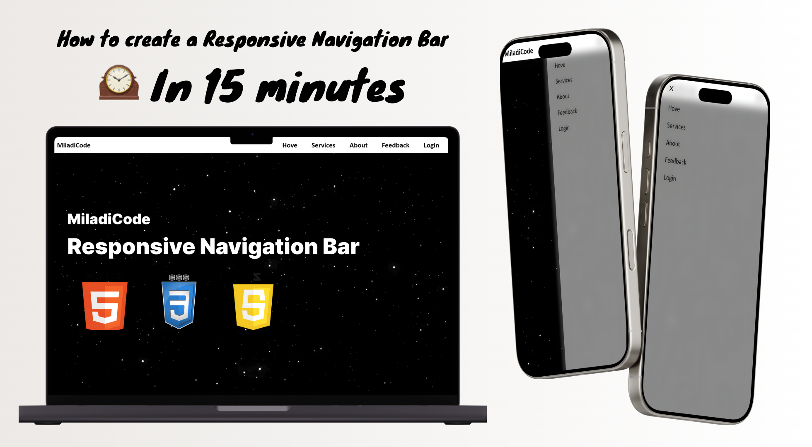

---
## Introduction: 
#### A simple responsive navigation bar with a hamburger menu and a dropdown menu. This is a basic example of how to create a responsiv navigation bar using HTML, CSS and JavaScript. 
#### The navigation bar has a hamburger menu that appears on smaller screens and a dropdown menu that appears when you open the sidebar.

---
## Watch the full tutorial on YouTub
